<h1 align="center"> Peg Solitaire Game 3D </h1>   

<!--  &nbsp; -->

<!-- START doctoc generated TOC please keep comment here to allow auto update -->
<!-- DON'T EDIT THIS SECTION, INSTEAD RE-RUN doctoc TO UPDATE -->

## Table of Contents

- [Table of Contents](#table-of-contents)
- [Introduction](#introduction)
- [Screenshots](#screenshots)
- [System Requirements](#system-requirements)
- [Technologies](#technologies)

<!-- END doctoc generated TOC please keep comment here to allow auto update -->

 

## Introduction

This mobile application is a 3D Peg Solitaire Game, featuring five different types of boards. 
At the end of each game, players see their scores.
The game is designed to be played in single-player mode but also there is a computer mode which computer plays the game.
Players can also save their progress to continue playing at a later time. 
The application is designed with high-quality graphics, sound effects, and music. 
It is coded using C# in the Unity game engine.

 

## Screenshots

* Home   
    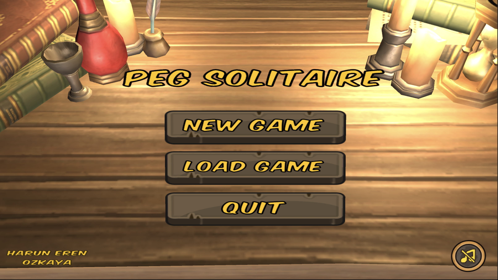  

* Board Type   
    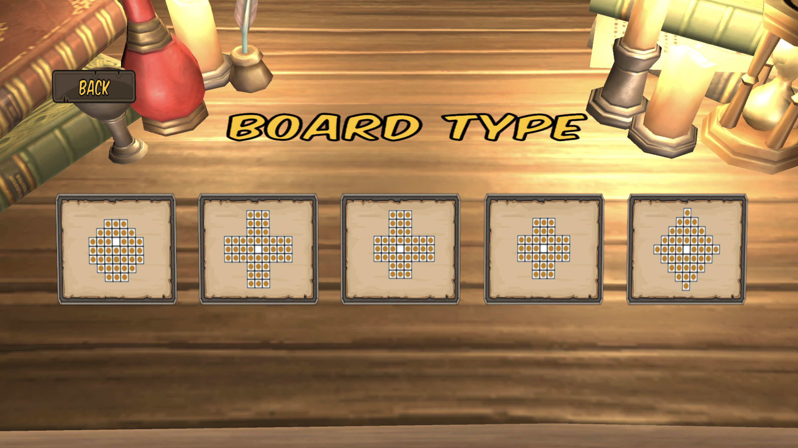  

* Player Type   
    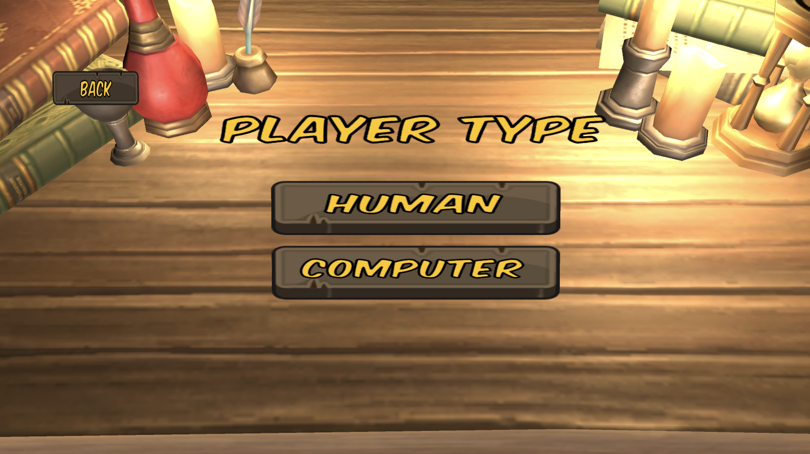  

* In game   
    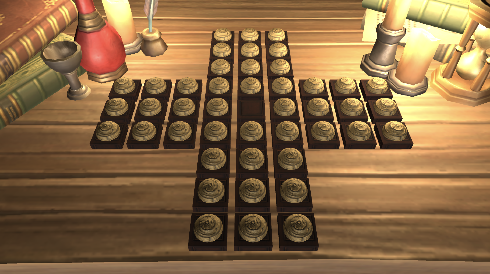  
    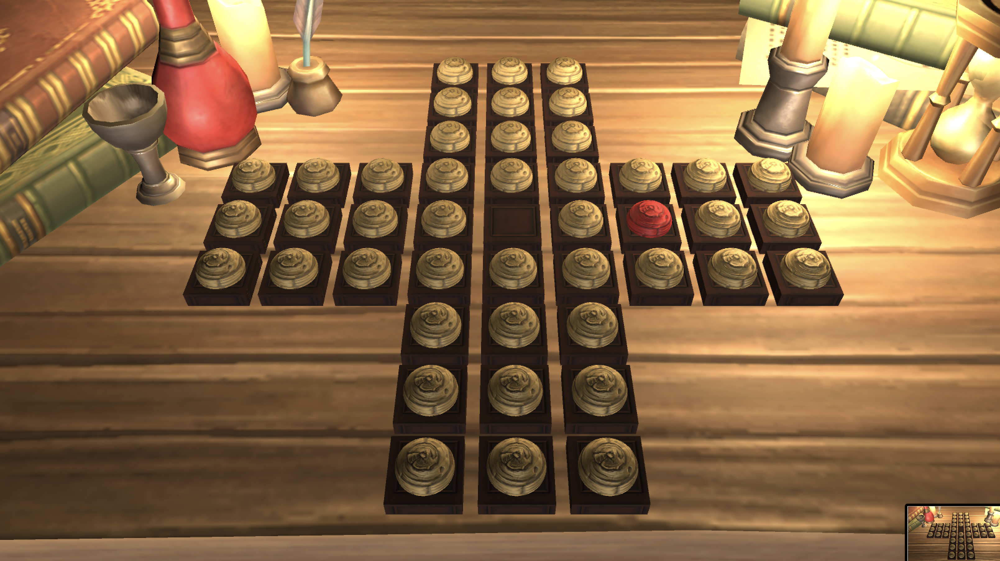  
    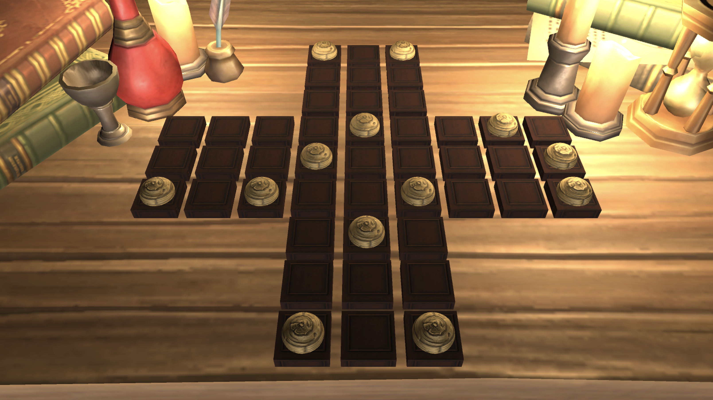  

* Score   
    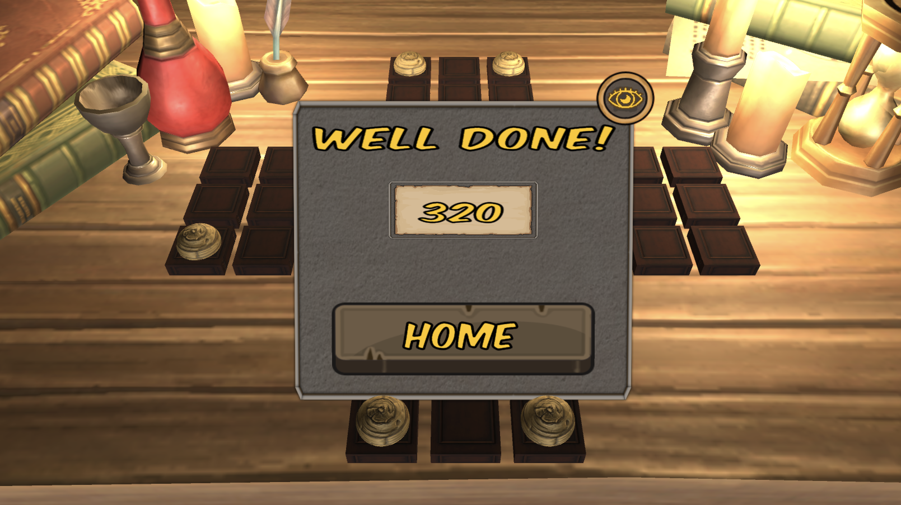  
    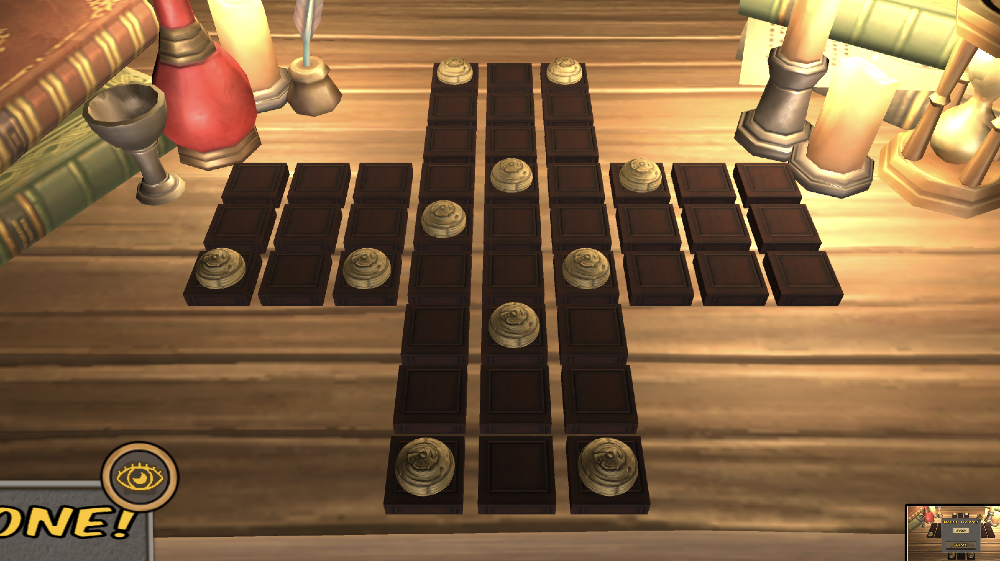  

* Save and Load Game   
    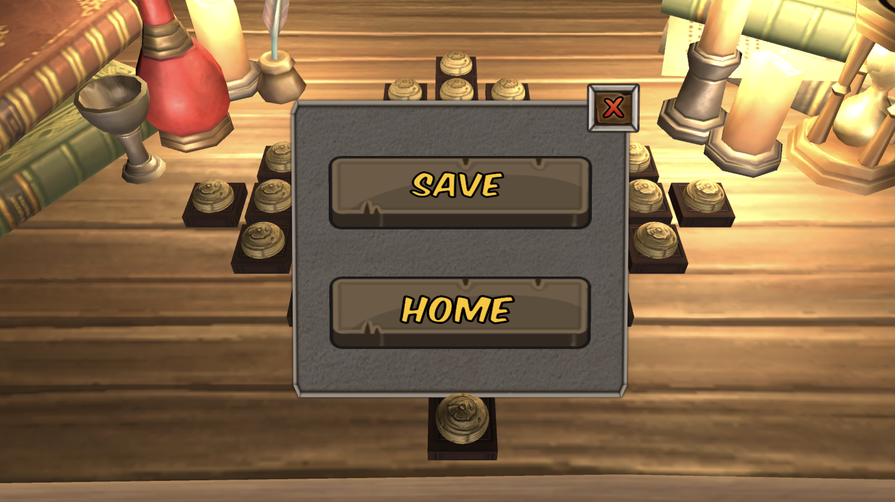  
    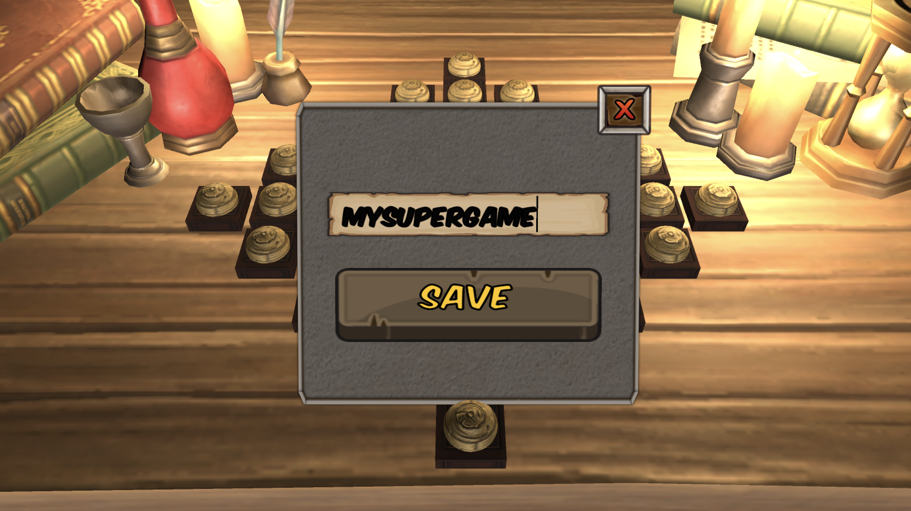  
    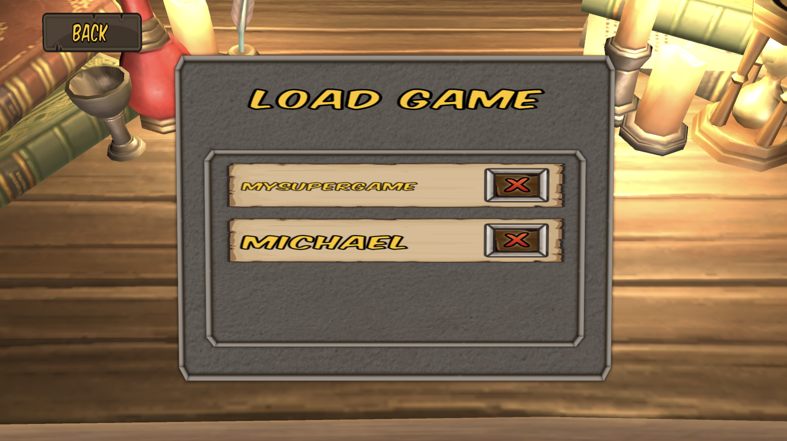  

## System Requirements

- Unity 2020.3.28f1

## Technologies

- C#
- Unity
